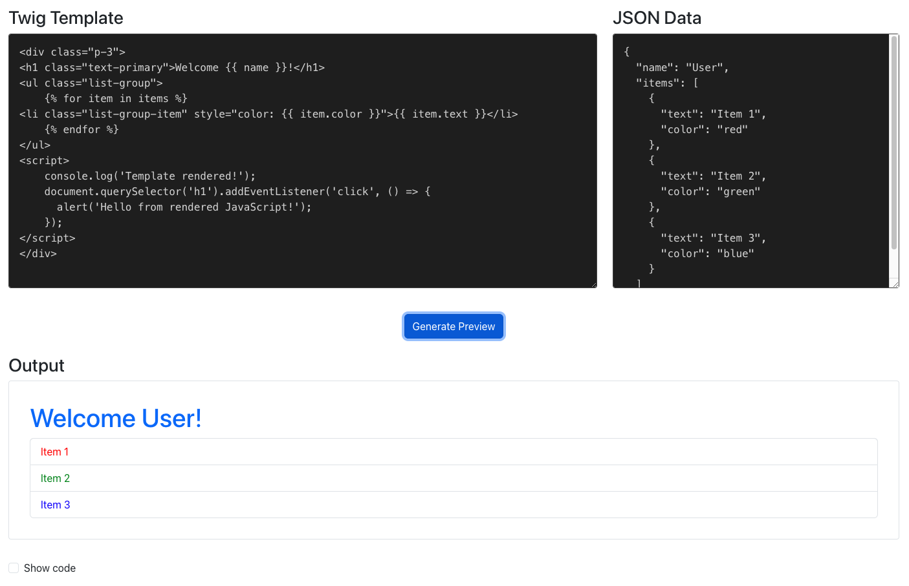

# Twig Preview App using React

|  |
|:------------------------------------------------:|

A simple React app to preview your Twig template code. 

App allows you to input twig template and also pass JSON data to the template.

## Installation

1. Open terminal
2. Clone the repository
2. `cd react-twig-preview`
3. Run `npm i`

## Run the app

`npm start`

Open `http://localhost:3000/` in your preferred browser